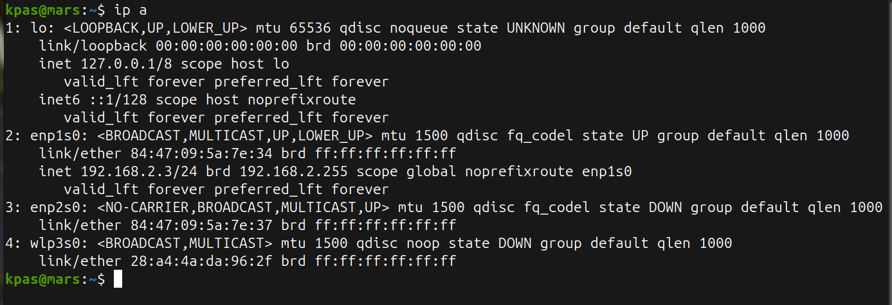
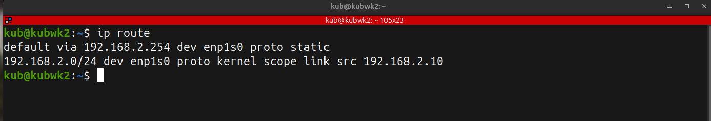

## IP command

| Discription      | Commnad |
| :---             | :--- |
| List out interfaces |  `ip a` |
| View route entries  |  `ip route` |

> [!Note]
> The above command are not just for viewing but can be used to add, delete, and modify entries.
 

  <h2>IP view interface example</h2>
   
  <h2>IP view route example</h2>
  

