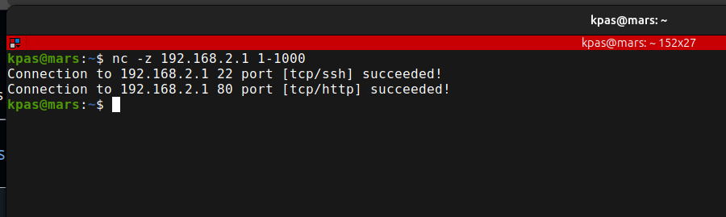

## NCAT

| Discription      | Commnad |
| :---             | :--- |
| Listen on a port |  `nc -l <port>` |
| Port Scan        |  `nc -z <target IP> <port range>` |
 

  <h2>NCAT scanning examples</h2>
  

