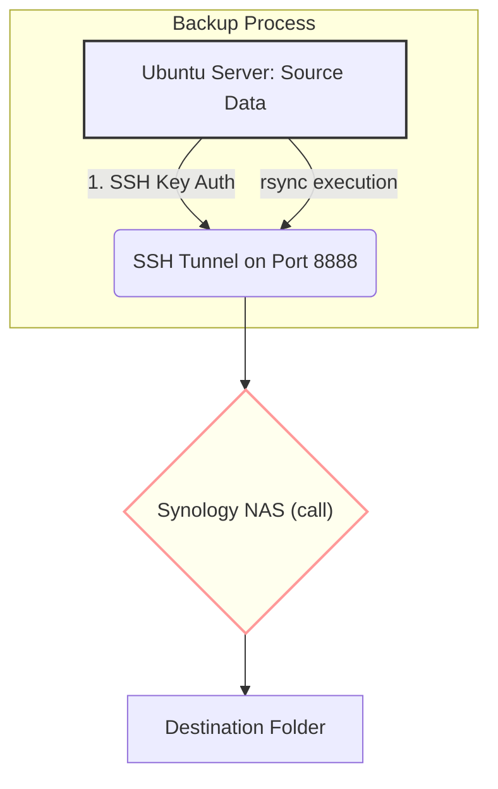

# Ubuntu 26.04 to Synology DS1522+ Rsync Backup Guide
[](your_ci_link)
[](LICENSE)

<p align="center">
  
</p>

## 📜 Overview
This project goes over the scripts and configuration needed to establish a daily backup from a local Ubuntu server (26.04) as the source, to a Synology DS1522+ as the destination. The project uses `rsync` over an SSH tunnel on non standard port such as 8888 to ensure secure, incremental transfer of data.  The automation uses a bash script that is ran by a CRON JOB once a day.  

## ⚙️ Architecture Flow Diagram


## 🚀 Prerequisites & Initial Setup
Before running the scripts, ensure the following are in place:

1. Network and Services Check (On Synology NAS)
Ensure that SSH and RSYNC are enabled on the DSM.

2. Authentication Key Setup (On Ubuntu Server)
   Need to generate ssh keys which will not requie the storage of a password to access the DSM
```note
Depending on the setup the Synology firewall might need an explicit rule allowing incoming traffic on Port xx for the IP address of your Ubuntu server (192.168.x.x).
```

## Generate SSH key pair
On the Ubuntu server run the below command to create keys
```bash
ssh-keygen -t rsa -b 4096 -f ~/.ssh/id_rsa
```
## Copy Public Key to Synology NAS DSM
On the Ubuntu server run the below command.  If using the standard SSH port of 22, no need to use `-p <port>`.
```bash
ssh-copy-id -p <port> <DSM Username>@<DSM IP Address>
ssh-copy-id -p 8888 call@192.168.1.1

NOTE: You will be prompted for your Synology password one last time.
```
## Test Connetion
On the Ubuntu server run the below command.  If using the standard SSH port of 22, no need to use `-p <port>`.
```bash
ssh -p <port> <DSM Username>@<DSM IP Address>
ssh -p 8888 call@192.168.1.1

NOTE:  No password prompt should be seen.
```
## Bash Script
Open up an editor on the Ubuntu server, such as `VI`. 
```
#: vi rsync_script.sh
```

```bash
#!/bin/bash

# --- CONFIGURATION VARIABLES ---
SOURCE_DIR="/path/to/your/directory/"      # Local directory on the Source Server
NAS_USER="DSM Username"                                          
NAS_IP="DSM IP Address"                                       
DEST_PATH="/path/to/where/it/should/go/"  # Target path on the destination server
SSH_PORT=<port #>  # If using SSH standad port input 22

# --- CRITICAL TARGET COMBINATION ---
REMOTE_TARGET="${NAS_USER}@${NAS_IP}:${DEST_PATH}"

echo "Starting rsync job at $(date)"
echo "Attempting to sync from source to target: ${REMOTE_TARGET} via port ${SSH_PORT}"


# The final command uses a single combined variable for robustness.
rsync -azh --delete \
      "${SOURCE_DIR}" \
      "${REMOTE_TARGET}" \
      -e "ssh -p ${SSH_PORT}" 

if [ $? -eq 0 ]; then
    echo "--------------------------"
    echo "Sync completed successfully at $(date)"
else
    # The error here means something failed during the transfer attempt
    echo "ERROR: Rsync failed! Check logs for details."
fi
```
Make the shell script excutable.
```
chmod 755 rsync_script.sh
```

## Test Connection

```bash
rsync -azh --delete \
      /path/to/your/directory/ \
      call@192.168.1.1:/path/to/where/it/should/go/ \
      -e "ssh -p 8888"

                OR

ssh -p 8888 call@192.168.1.1 "echo Connection OK"
```
## CRON Job
```bash
0 3 * * * /bin/bash -c "cd /home/call && /bin/bash /home/call/rsync_script.sh" >> /var/log/rsync_syno_cron.log 2>&1
```

|Position|Value|Description|Meaning|
| --- | --- | --- | --- |
|Minute|0|The minutes past the hour (0–59).|At minute 0.|
|Hour|3|The hour of the day (0–23).|At 3 o'clock AM.|
|Day of Month|*|The day of the month (1–31).|Every day.|
|Month|*|The month (1–12).|Every month.|
|Day of Week|*|"The day of the week (0–7, Sunday=0)."|Every day of the week.|

This segment tells the system how to run the rest of the command.

**/bin/bash**: This explicitly calls the Bourne Again Shell. Using an explicit path like this is best practice in cron jobs because it guarantees that the correct interpreter will be used, regardless of the default environment variables.

**-c "..."**: The -c flag tells bash to read the string enclosed in quotes ("...") as a complete script or sequence of commands, and then execute them immediately.

**"cd /home/call**" Where to find the script

**&&**: xecute the command that follows only if the previous command succeeded.

**/bin/bash /home/call/rsync_script.sh"**: It explicitly uses `/bin/bash` to execute the script, named `rsync_dasVault.sh`

**>> /var/log/rsync_syno_cron.log**: The double angle bracket (>>) means append. All standard output (STDOUT) will be appended to this file. If the log file doesn't exist, it will be created.

**2>&1**: This will ensure that both successful output and any errors are captured and logged into /var/log/rsync_syno_cron.log.
